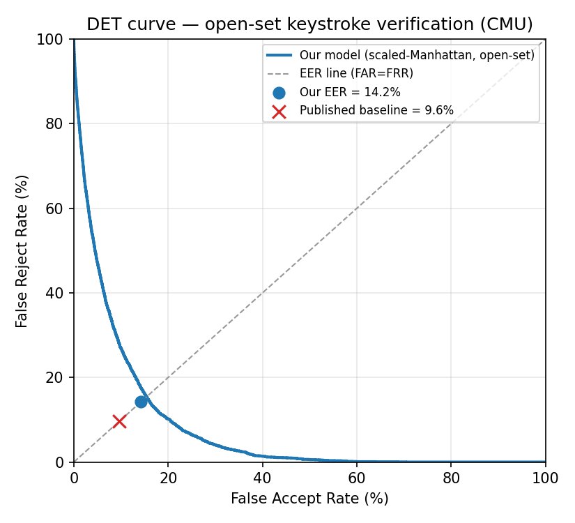
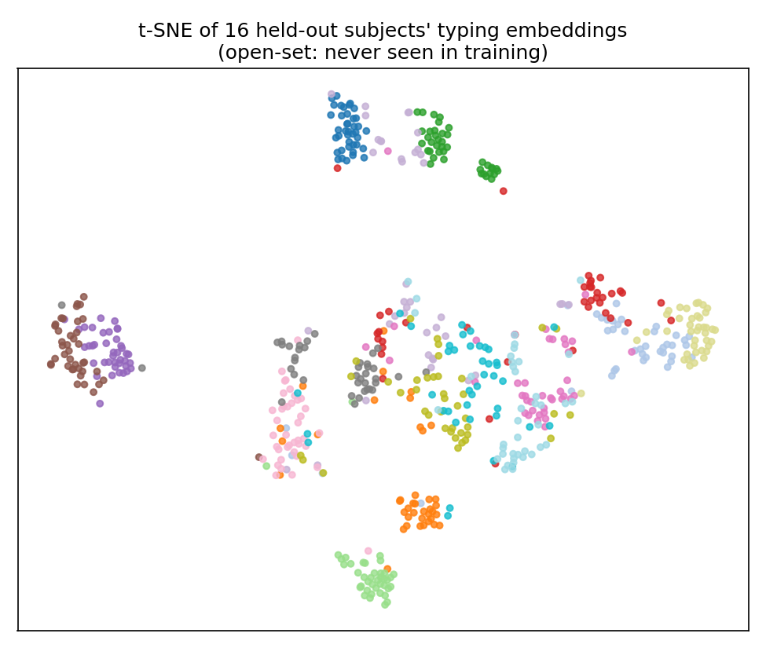

# Can You Be Recognised by the Way You Type? Building and Testing a Keystroke-Dynamics Verification System

**A CREST Gold Award Research Project**

| | |
|---|---|
| Student | Devadit Jain |
| Project type | Research / investigation (with a design-and-make engineering component) |
| Project title | Content-independent keystroke-dynamics verification: can a deep embedding plus a classical statistical verifier recognise a person from typing rhythm alone, and how close does it get to the published benchmark? |
| Field | Computer science · machine learning · cybersecurity / behavioural biometrics |
| Mentor / supervisor | None — independent project, no mentor or supervisor |
| Dates | 25 November 2025 – 10 June 2026 (research sprint 8–10 June 2026) |
| Word count | ≈ 9,900 words |
| Pages | _Numbered throughout; the Student Profile Form maps each of the 15 CREST criteria to the sections below._ |

> **A note on AI use, read first.** I designed, built, debugged and evaluated this system myself. I used an AI assistant (Anthropic's Claude, inside the Claude Code tool) to help with coding, debugging and drafting, which CREST allows. Section 12 sets out exactly what it did and what I checked. Every number in this report came out of code running on my own laptop and can be regenerated with a single command; none is made up.

---

## Abstract

A password only proves that someone knows a secret, not that they are the account's owner. Keystroke dynamics — the rhythm of how someone types — is a behavioural biometric that could add a silent second identity check. This project asks one question: can a deep embedding of typing timing, combined with a classical statistical verifier, recognise a person from rhythm alone, and how close does it get to the published benchmark?

I built the system in three parts: a PyTorch research harness that trains the model, a FastAPI service that serves the frozen model, and a Node.js product layer where a real user can consent, enrol and be verified. The model is a 1-D convolutional + bidirectional-GRU + attention network that turns a window of keystrokes into a 128-number vector; on top of that learned representation a hand-built ensemble (Ledoit–Wolf shrinkage + Mahalanobis + nearest-neighbour) makes the accept/reject decision.

I tested on the standard CMU benchmark (51 people typing `.tie5Roanl`) under a strict open-set protocol: train on 35 people, test only on the 16 never seen, so the result measures generalisation to new users. Over three seeds it reached an Equal Error Rate (EER) of 14.2% ± 2.8% with the scaled-Manhattan scorer — the metric directly comparable to the published 9.6% baseline — and 10.2% ± 1.0% with the full ensemble. The main finding is not that the deep model beats the classical baseline; it is that running a classical verifier inside a learned embedding space gets close to the baseline with about three times lower variance, on people it never trained on. The report also documents the closed-set mistake that would have produced a better-looking but meaningless number, twelve other problems found and fixed (including a crash that only showed up live), an ablation confirming the settings were near-optimal, and an ethics section treating biometric data as the special-category data it legally is.

---

## Table of Contents

1. Introduction and project planning
2. Background and literature
3. Method
4. Results
5. Discussion
6. How my decisions shaped the outcome
7. Problems I found and fixed
8. Ethics and safety
9. Reproducibility
10. Reflection
11. Conclusion
12. AI use statement
13. References
14. Appendices (A: criteria map · B: glossary · C: full results · D: code map · E: risk assessment)

---

# 1. Introduction and project planning

## 1.1 Aim and objectives

> **Aim:** Find out whether a content-independent deep embedding of keystroke timing, combined with a classical statistical verifier, can verify a person's identity from typing rhythm alone, and measure how its open-set EER compares with the published scaled-Manhattan benchmark of 9.6% on the CMU dataset.

I wrote the aim with a clear pass/fail test: a single number, the Equal Error Rate (§2.3), measured under a protocol fixed before I saw the result, against a published reference. Success meant (a) a real, reproducible EER on people it never trained on, and (b) a number readable against the 9.6% baseline — beat, match or fall short, each meaningful as long as the measurement is honest.

I broke the aim into six objectives, each with a success condition I could check:

| # | Objective | Success condition | Outcome |
|---|---|---|---|
| O1 | Build a keystroke-embedding network | Maps a variable-length window to a fixed 128-D vector; forward pass runs on CPU | Met (§3.3) |
| O2 | Train it so same-person windows cluster and different-person windows separate | After training, mean within-person distance < mean between-person distance, checked by a test | Met (§3.4) |
| O3 | Evaluate honestly on a public benchmark, open-set | EER computed only on held-out people; the evaluator refuses to score training data | Met (§3.6, §4) |
| O4 | Reuse a statistical ensemble as the decision layer inside the embedding space | Two EERs reported (scaled-Manhattan vs full ensemble) from one run | Met (§4.1) |
| O5 | Make the pipeline reproducible | One script regenerates the result from a SHA-pinned dataset and fixed seeds | Met (§9) |
| O6 | Show it working in a real product flow with safe failure | A live service serves the model; a user can consent → enrol → be verified; outages never grant access | Met (§3.8, §6) |

Forcing each objective to carry a checkable condition is what stopped me hiding a non-result behind something that merely "ran" — the trap I nearly fell into (§7.1).

## 1.2 Wider purpose

Passwords check knowledge, not identity: anyone who steals or guesses one becomes, as far as the system is concerned, the real owner. Account-takeover is large and stubborn — Verizon's 2024 Data Breach Investigations Report found stolen credentials were involved in about 88% of Basic Web Application Attacks, and credential-stuffing (replaying leaked username/password pairs automatically) is a dominant login attack (Verizon, 2024). Multi-factor authentication helps but adds friction people switch off. That is the gap a behavioural biometric could fill: instead of asking the user to do something extra, the system watches how they already type. The idea is old — telegraph operators were recognised by the rhythm of their "fist" in the 19th century — but modern machine learning makes content-independent typing recognition genuinely practical (Acien et al., 2021): an invisible second factor at login, a continuous session check, or a lower barrier for people who find passwords and tokens hard to manage.

The people who would benefit are ordinary account holders on any site with a login — in my case the players of *Typing Sanctuary*, the typing game that is this project's product side, who already type constantly so the biometric needs nothing new of them. They are also the ones put at risk if the technology is built carelessly, which is why I treat ethics (§8) as part of the project, not an add-on.

This isn't abstract for me. What made the weakness of passwords real was a security incident of my own: an account I cared about was broken into with stolen credentials, and the system never noticed anything was wrong — the password was correct, so to the login the attacker simply *was* me. The fact that a perfectly correct password defended nothing is what pushed me towards behavioural biometrics, and towards the question behind this whole project: could *how* a person types be a quiet second check that a stolen password can't fake?

## 1.3 Approaches I considered

There were three genuinely different ways to build the verifier. I compared them before committing.

**A — Pure statistical / anomaly detection (the classical baseline).** Score a new sample against a per-user statistical profile of hand-designed timing features, using a distance like scaled-Manhattan or Mahalanobis — what Killourhy & Maxion (2009) benchmarked. Simple, interpretable, no cross-user training, strong published results (≈ 9.6%); but tied to fixed text, breaks on new passwords or free text, and a human chooses the features.

**B — Pure deep classifier.** A softmax over the enrolled users: accurate on a fixed set, but closed-set by nature — every new sign-up means retraining the whole network, a dealbreaker for a product where people sign up constantly.

**C — Deep metric-learning embedding (chosen).** Train the network to *embed*, not classify: map any window to a vector so same-person windows land close and different-person far apart, via a triplet loss (Schroff et al., 2015; Hermans et al., 2017). A new user is enrolled by storing a few embeddings — no retraining. Open-set by construction (the standard in modern face/biometric recognition), content-independent and reasonably data-efficient; harder to train, and the raw embedding still needs a decision rule on top.

Rather than throw away the classical statistics of A, I run them inside the learned embedding space of C: the network gives the representation, and a Ledoit–Wolf Mahalanobis + nearest-neighbour + scaled-Manhattan ensemble makes the decision. That combination is the core idea of the project.

| | A: Statistical | B: Deep classifier | C: Metric embedding (+ ensemble) |
|---|---|---|---|
| Open-set (new users, no retraining) | yes | no | yes |
| Content-independent (any text) | no | partial | yes |
| Data efficiency | high | low | medium |
| Compute cost (training + each new sign-up) | low (no training) | high (retrain on every new user) | low (train once; enrolment is cheap) |
| Build time (effort in this sprint) | low (reuse tested stats code) | medium | medium–high (hardest to train) |
| Interpretability | high | low | medium |
| Published precedent | strong (9.6%) | some | strong (TypeNet, FaceNet) |
| Risk to build in a short sprint | low | medium | medium–high |
| Fit to an authentication product | poor | poor | best |

I chose C with the A-style ensemble on top: only an open-set, content-independent method fits a product where users keep signing up, and keeping the classical verifier let me compare directly against the 9.6% baseline and reuse tested statistical code rather than discard it.

## 1.4 The plan, and why this shape

The system has three parts, sharing exactly one thing — the trained model — across a clean boundary:

1. **Research harness** (`research/`, PyTorch) — *makes* a frozen, versioned model reproducibly (fixed seeds, pinned dataset, recorded git commit).
2. **Inference service** (`ml-service/`, FastAPI) — *serves* it through `/embed`, `/verify`, `/health`; holds the model in memory, stores nothing, logs no raw timings.
3. **Product shell** (Node.js / Express) — the existing game; owns users and sessions, calls the service, enforces the decision.

Keeping the thing that *makes* the claim separate from the thing that *serves* it means the live app never trains or touches a dataset, and the research never touches live user data, joined by a single fixed contract (`EMBED_DIM = 128`, L2-normalised). I also fixed the failure behaviour up front: fail-safe, never fail-open — any outage or version mismatch returns "indeterminate" and falls back to another factor rather than silently letting someone in. A security feature that admits everyone when it breaks is worse than none; this was non-negotiable, and it later caught a real bug (§7.5).

## 1.5 Plan and timeline

Building everything under version control means every step has a real, dated timestamp, so the 87 git commits (Nov 2025 – Jun 2026) act as an automatic logbook. 37 of them cover the six-month foundation (the game and the first two biometric engines), and 50 fall inside the three-day research sprint of 8–10 June 2026 (33, 13 and 4 on the three days). The dated milestone timeline below comes straight from the commit history (Nov 2025 – Jun 2026), and the three-day research sprint is broken out day by day:

| Date (from git) | Milestone |
|---|---|
| 2025-11-25 | Game project begins ("Initial commit — Speed Typing Battle") |
| Dec 2025 | Multiplayer, leaderboard, hearts/penalty system |
| 2026-02-21 | Google OAuth + first keystroke-biometrics capture (v1) |
| 2026-03-28 | Statistical biometric engine (v2) |
| 2026-06-08 09:03 | Design specification for the deep-model rebuild |
| 2026-06-08 09:30 | Fixed a production JWT bug (`req.userId`) that had silently disabled the live feature |
| 2026-06-08 10:30–17:47 | Model: metrics, ensemble port, featurization, encoder (CNN+BiGRU+attention), triplet loss, deterministic trainer, versioned artifact |
| 2026-06-08 19:50–20:46 | Honest EER evaluator, scripted CMU download with SHA-256, Phase-1 CLI, column-remap fix |
| 2026-06-09 07:21–09:07 | Serving (`TorchEmbedder`), free-text path, Modal GPU config, load-time dimension guard |
| 2026-06-09 16:32 | Open-set evaluation fix + ensemble EER + pinned dataset |
| 2026-06-09 16:42 | Standalone product slice (consent → enrol → verify) |
| 2026-06-09 17:19 | Trained on real data → measured EER; figures; fixed a live bug |
| 2026-06-09 22:29 | Open-set free-text Phase-2 + reproducibility chain |
| 2026-06-10 | Nested-validation ablation (test set kept untouched); confirmed settings near-optimal |

CREST expects ~70 hours at Gold; my breakdown, estimated against the dated commit clusters, comes to about 84:

| Phase of work | Approx. hours | Evidence |
|---|---|---|
| Background reading (CREST research; ~18 papers; CMU, TypeNet, FaceNet, Ledoit–Wolf, GDPR) | ~10 | §2, §13, dossier |
| Product-shell work relevant to the research (capture v1/v2, the serving seam) | ~14 | 37 foundation commits |
| Research design (architecture, the fixed contract, the open-set protocol) | ~8 | Design-spec commit |
| Implementation (encoder, triplet loss, ensemble, evaluator, profile builder, service) | ~20 | Sprint commits Jun 8–9 |
| Experiments and debugging (training runs, open-set fix, the 13 problems, the ablation) | ~14 | §7, metrics, sweep results |
| Analysis and figures (EER, DET, t-SNE, per-subject, ablation) | ~6 | §4, figures |
| Writing, ethics and reflection | ~12 | this report |
| **Total** | **~84** | above the 70-hour expectation |

Two milestones slipped during the sprint, both deliberate calls: deferring GPU training (the model trained in ~23 min on my laptop for £0, so the ~£0.10–0.50 cloud step wasn't worth the dependency) and scaling free-text Phase-2 back to "pipeline proven, real corpus deferred" rather than spend the sprint downloading the 136-million-keystroke Aalto corpus (§10). The planned-versus-actual view makes the three replans explicit:

| Planned | Actual | Why it changed |
|---|---|---|
| Write the evaluator, then measure the EER | Wrote it, caught a closed-set flaw, rebuilt the protocol, *then* measured | The biggest replan: the closed-set bug (§7.1) forced an unplanned protocol redesign mid-sprint |
| Train on a cloud GPU | Trained on local CPU (~23 min, £0) | The model was small enough to train on a laptop, which removed the cost and an external dependency and made the result easier to reproduce |
| Phase-2 free text on the real Aalto corpus | Pipeline built and proven on a fixture; the real-corpus run deferred to future work | Downloading the 136-million-keystroke corpus was more schedule risk than value inside a three-day sprint (§10) |

## 1.6 Materials, tools and people

- **Dataset:** the CMU Keystroke Dynamics Benchmark (`DSL-StrongPasswordData.csv`), Killourhy & Maxion, Carnegie Mellon — 51 people, 400 repetitions each of `.tie5Roanl`. Taken from the authors' public page and pinned by SHA-256.
- **Languages and libraries:** Python 3.12; PyTorch 2.12 (CPU) for the network; NumPy for the ensemble; FastAPI + Uvicorn for the service; scikit-learn (t-SNE) and Matplotlib for figures; Node.js / Express for the product; Jest and pytest for testing.
- **Statistical method:** the Ledoit–Wolf shrinkage covariance estimator, cross-checked against scikit-learn's implementation.
- **Infrastructure considered:** Modal (serverless GPU) for a future deployment — configured but not run, to avoid cost.
- **Tooling:** Git (version control, and a handy dated logbook); the Claude Code AI assistant (fully disclosed in §12).
- **People:** an independent project with no mentor. The "people" side came from the wider research community rather than one person: the authors whose methods I built on (Killourhy & Maxion; the FaceNet and TypeNet teams; Ledoit & Wolf), the maintainers of the libraries I used, and the standards I read (ISO/IEC 19795-1; the ICO's GDPR guidance). The job a mentor usually does — being the second person who distrusts a convenient result — I had to do myself by auditing my own work, which is how the most important mistake got caught (§7.1); I note the lack of an outside reviewer honestly as a limitation (§10).

---

# 2. Background and literature

This section sets out the science the project rests on and pulls the prior work together to find the gap — joining threads rather than summarising paper by paper.

## 2.1 Keystroke dynamics as a behavioural biometric

Biometrics split into physiological (fingerprint, iris, face — what you *are*) and behavioural (signature, gait, typing rhythm — how you *behave*). Keystroke dynamics is behavioural: it describes a person by the timing of their typing, not the content. The basic measurements are inter-key timings:

- **Hold time (dwell):** how long a key is held down.
- **Down–down latency:** time between pressing one key and the next.
- **Up–down latency (flight time):** time between releasing one key and pressing the next.
- **Up–up latency:** time between releasing consecutive keys.

These are surprisingly personal, coming from motor habits and hand geometry that are hard to fake on purpose. Fixed-text (everyone types the same string — the CMU benchmark) is easier, because you compare matching keystrokes directly; free-text (anything the person types, needed for continuous authentication) needs a content-independent model that learns rhythm regardless of the words. A recent ACM Computing Surveys review (2024/25) describes the field moving from hand-built statistical detectors in the 2000s to deep representation learning in the 2020s — the transition this project sits on.

## 2.2 Metric learning and embeddings

The key move in modern biometrics is to stop asking "which known user is this?" (classification) and instead learn an *embedding*: a function mapping an input to a vector space where distance encodes identity. FaceNet (Schroff et al., 2015) set the template — a network trained with a triplet loss so embeddings of the same person are close and different people far apart. A triplet is (anchor, positive, negative): same, same, different; the loss pushes the anchor–positive distance below the anchor–negative distance by a margin:

> `L = max(0, d(anchor, positive) − d(anchor, negative) + margin)`

FaceNet used a 128-D embedding and reached 99.6% on faces; I use the same 128-D, L2-normalised design for keystrokes. Hermans et al. (2017) showed *which* triplets you pick matters, and that batch-hard mining — for each anchor, the hardest positive and hardest negative in the mini-batch — is a simple, strong choice; I use it. Wen et al. (2016) added a center loss pulling each class toward its centre, tightening clusters; I add a small amount to keep per-user spread under control. L2-normalisation (each embedding divided by its length, landing on the unit sphere) makes distance depend on *direction*, not magnitude — the right thing for comparing rhythm patterns.

## 2.3 The decision, and how you measure it

A raw embedding is not yet a decision. The verifier turns "how far is this window from the user's profile?" into accept or reject, using three distances together:

- **Scaled-Manhattan:** mean absolute deviation from the user's mean, scaled by per-feature spread — the exact form of the best CMU detector, giving a like-for-like comparison.
- **Mahalanobis:** accounts for correlations between dimensions via the inverse covariance matrix. With a handful of enrolment samples in 128 dimensions the raw sample covariance is unstable and not invertible, so I use Ledoit–Wolf shrinkage (Ledoit & Wolf, 2004), which blends it with a well-behaved target to guarantee a stable, invertible matrix — exactly the small-sample, high-dimensional situation enrolment lives in.
- **Nearest-neighbour:** mean distance to the *k* closest enrolment embeddings, coping with people who type in more than one way.

A verifier makes two errors: accepting an impostor (False Accept Rate, FAR) and rejecting a genuine user (False Reject Rate, FRR); moving the threshold trades one for the other. The Equal Error Rate (EER) is where FAR = FRR — the standard single-number summary of a biometric, lower better — and plotting FAR against FRR across thresholds gives the Detection Error Trade-off (DET) curve. These follow ISO/IEC 19795-1.

## 2.4 Prior work and the gap

Two reference points bracket this project:

- **The classical benchmark, Killourhy & Maxion (2009).** They collected the CMU dataset (51 people × 400 reps of `.tie5Roanl`) and compared 14 anomaly detectors; the best, scaled-Manhattan, reached EER 0.0962 (9.6%) — the number I measure against.
- **The deep state of the art, TypeNet (Acien et al., 2021).** A Siamese LSTM trained on 136M+ keystrokes from ~168,000 people, reaching EER 2.2% (physical keyboard) and 9.2% (touchscreen) and scaling to 100,000 users — showing learned, content-independent keystroke embeddings work at internet scale.

TypeNet shows deep embeddings work given enormous data; CMU shows classical statistics work on small fixed-text data. The under-explored middle ground a student-scale project can contribute to: on the small, public, reproducible CMU benchmark, does a deep embedding *plus* a classical verifier do better than the classical verifier alone, tested honestly on people it never trained on? That is the falsifiable question. The contribution is not a new record but a careful, reproducible, honest measurement of a hybrid design, with the failure modes written down.

---

# 3. Method

This section is the build, in enough detail to reproduce. The pipeline is: one keystroke window → one 128-number vector → a decision.

## 3.1 Dataset

The CMU file holds, for 51 people × 400 reps, the timing of typing `.tie5Roanl` then Return — 11 keys, giving 31 timing columns per row and 20,400 rows. I checked it structurally and pinned it by SHA-256, so any run uses provably the same bytes. One detail mattered: the real file names columns by key (`H.period`, `H.Shift.r`, `H.Return`), not printable character, so a loader expecting `H..`, `H.R`, `H.\n` would quietly read all-zero timings and train on nothing while still printing a believable number. I wrote a column remap plus an assertion that the first window is exactly 11 keys spelling `.tie5Roanl` with non-zero timings (§7.3).

## 3.2 Feature representation

Each keystroke becomes a small vector: four timing features (hold, down-down, flight, up-up) plus a learned embedding of which key it was. Timings are measured relative to the window's first keystroke, so the absolute clock value drops out and precision is kept. The network sees which keys and their rhythm, never the text's meaning — so the representation is content-independent and can in principle carry from the fixed CMU password to free typing (the basis of Phase 2). The same featurization code runs in training and serving, so the served model can't see different features from the trained one.

## 3.3 The encoder

The encoder (`KeystrokeEncoder`) turns a window into a 128-D L2-normalised vector in four stages:

1. **Input fusion** — each keystroke's four timing features join a 16-D learned character embedding → a 20-D per-keystroke vector. The character embedding lets the network learn keyboard geography rather than being told it.
2. **1-D convolutions** — two `Conv1d` layers (20→64→64, kernel 3) pick up local rhythm (adjacent key-pairs, or digraphs).
3. **Bidirectional GRU** — a recurrent layer (64 each way → 128) reads the sequence both directions, catching longer-range cadence.
4. **Attention pooling → projection → L2-norm** — attention weights time steps (the network learns which keystrokes matter), a linear layer projects to 128-D, and L2-normalisation puts the vector on the unit sphere.

I chose CNN + BiGRU + attention over a Transformer deliberately: at this data scale a Transformer would overfit, whereas this is data-efficient and reproducible. The network has only ~83,500 parameters (≈ 0.08 M) — small enough to train to ~10% open-set EER on a laptop CPU in minutes, with little room to overfit a 51-person benchmark.

## 3.4 Training

I train with batch-hard triplet loss (margin 0.2) plus a small center-loss term (weight 0.01), using Adam; each mini-batch picks several people with several windows, and batch-hard mining selects the hardest positive and negative per anchor. Training is deterministic (global seed, single-process loader), so the same seed reproduces the same weights bit-for-bit on CPU. A test checks same-person embeddings are closer than different-person ones (O2), guarding against a collapsed encoder.

## 3.5 The verification ensemble

After training, a user is enrolled (not retrained) by embedding ~12 of their windows into a profile: the centroid, the enrolment embeddings themselves (for nearest-neighbour), and the Ledoit–Wolf inverse-covariance matrix. A new window is scored by three distances to that profile — scaled-Manhattan, nearest-neighbour, Mahalanobis — fused into one score, which a per-user threshold maps to a confidence and risk level. Crucially these statistics run inside the *learned* 128-D space, not on raw timings: the network gives the representation, the ensemble gives the decision. The same fusion code runs in research and in the live service, so the EER I measured and the decision I ship are the same maths.

## 3.6 Evaluation protocol

This is where the project's credibility rests.

**Open-set, held-out people.** I split the 51 people (seeded) into 35 for training and 16 held out; the encoder trains only on the 35 and the EER is measured only on the 16 it has never seen, so the result measures generalisation to new people — the only thing that matters for real authentication. A runtime check guarantees no test person leaks into training. This replaces an earlier closed-set mistake that would have produced a much lower but meaningless number (§7.1).

**Genuine versus impostor, within each test person.** For each test person I split their windows into an enrolment half and a test half; genuine windows are scored against the profile built from the enrolment half (so a window is never scored against itself), and impostor windows are the other test people's. If a person has too few windows to hold a test set out, the evaluator raises rather than invent a number — a guard added after an earlier version scored training data and produced a fake 0.0 EER (§7.4).

**Two metrics, labelled honestly.** Scaled-Manhattan EER is the headline (the exact metric of the 9.6% baseline); the full-ensemble EER is secondary, and I never compare the ensemble against a scaled-Manhattan baseline, which would tilt the comparison in my favour.

**Three seeds.** Because the split and training are random, I run seeds 42/43/44 and report mean ± SD, so a near-baseline result can't be waved away as noise.

**Hyperparameters by nested validation.** Trying many settings and keeping the one that scores best on the test set quietly turns the test set into a training signal. So I set the 16 test people aside first and, inside the 35 training people, carved a further 24 inner-train / 11 validation split, judging every setting only on the validation people; the validation winner was then run once on the 16. Because nothing was chosen using the test set, the final EER stays an honest open-set estimate (the ablation in §4.6).

## 3.7 Reproducibility engineering

Every artefact carries its provenance: the model file records the git commit, embedding dimension and feature spec; the metrics file records the dataset SHA-256, seeds, protocol and the same commit. One command regenerates the result from pinned data, and the model loads with `weights_only=True` so a swapped file can't run code in the service. I checked the chain end to end — model-commit equals metrics-commit, pinned SHA equals metrics SHA (§9).

## 3.8 The product layer

To show the model is more than a benchmark number, I wired a standalone slice (`/api/ml-keystroke/*`) into the game backend: a user consents, enrols by typing several windows (which become a profile), and is verified on a new window. The decision is fail-safe — if the service is unreachable or the model version doesn't match the profile, the result is INDETERMINATE and the product asks for another factor, never granting access by default. The slice is kept separate from the older statistical engine, and its safety behaviour is tested (§6, §7.5).

---

# 4. Results

Everything below was trained on real CMU data on a laptop CPU (no GPU), averaged over three seeds (42, 43, 44), and is reproducible with one command (§9). The full run took about 23 minutes and cost £0.

## 4.1 Headline result

Open-set EER on the 16 held-out people (mean ± SD over 3 seeds):

| Scorer | EER (mean) | SD | Per-seed | Comparison |
|---|---|---|---|---|
| Scaled-Manhattan (headline; comparable to baseline) | 0.1422 (14.2%) | ± 0.0279 | 0.1421 / 0.1764 / 0.1080 | vs published 0.0962 (9.6%) |
| Full ensemble (secondary; Manhattan + NN + Mahalanobis) | 0.1016 (10.2%) | ± 0.0097 | 0.1086 / 0.1083 / 0.0878 | — |
| Published baseline — Killourhy & Maxion (2009) | 0.0962 (9.6%) | (their SD 0.069) | — | reference |

Two things stand out. First, the ensemble is both more accurate and far steadier than the simple scorer: its EER (10.2%) is about four points better than scaled-Manhattan (14.2%) on the *same* embeddings, with roughly three times smaller SD across seeds (0.97% vs 2.79%). The hand-built ensemble, working in the learned space, pulls a more reliable decision out of the same representation — the hybrid idea from §1.3 paying off. Second, the honest open-set result sits *above* the baseline, not below it (14.2% and 10.2% vs 9.6%) — exactly what an un-leaked open-set result on a small CPU-trained model should look like. That it didn't come out implausibly low is itself a sign the evaluation is honest; a leaky or closed-set version would have produced a flattering number (§7.1).

## 4.2 The DET curve

The DET curve (Fig C.1) plots FRR against FAR across all thresholds for the headline scaled-Manhattan scorer; the EER point sits on the FAR = FRR diagonal at 14.2%, with the 9.6% baseline marked. It shows the trade-off directly: a security-first deployment moves up-left (lower FAR, higher FRR), a convenience-first one the other way.

## 4.3 Per-subject analysis

The 16 held-out people vary a lot in recognisability (full table in Appendix C):

- **Most distinctive** (lowest EER): s036 at 0.9%, s017 at 2.0%, s022 at 3.5% — essentially a strong authenticator.
- **Hardest** (highest EER): s047 at 33.5%, s007 at 29.5%, s037 at 23.4% — the 11-key password is too short and inconsistent to tell them apart reliably.

The spread is informative: the limiting factor isn't the model but the information in an 11-key fixed password, which for some people doesn't carry a distinctive enough rhythm — the main argument for free text (§10).

## 4.4 The embedding space (t-SNE)

To check *why* it works, I projected the held-out 128-D embeddings to 2-D with t-SNE (Fig C.2). Several people form tight, well-separated clusters — confirmation that the encoder maps a person's typing to a consistent region despite never training on them — while a denser middle region of overlap lines up with the high-EER people of §4.3, so picture and numbers agree.

## 4.5 End-to-end on a live user

Beyond the benchmark, I served the trained model and ran the real flow: a held-out person was enrolled, then genuine and impostor windows verified over HTTP. The mean genuine score (3.10) was clearly lower (more genuine) than the mean impostor score (6.73), so the deployed model ranks impostors as less genuine than the real user, behaving the same live as in the notebook. (This live test also turned up a real crash, §7.5.)

## 4.6 Was the headline setting well-chosen, or just lucky? An ablation

A fair criticism is whether I happened to pick good settings. To answer it without touching the test set, I ran the nested-validation ablation from §3.6: the 16 test people stayed untouched while, inside the 35 training people, a 24/11 inner-train/validation split judged one changed setting at a time.

| Setting (change from the original) | Validation primary EER | Validation ensemble EER | Final loss |
|---|---|---|---|
| Original (60 epochs, margin 0.2, centre-weight 0.01, 2 windows/subject) | 0.1933 | 0.1678 | 0.200 |
| more windows per subject (2 → 4) | 0.2572 | 0.1731 | 0.200 |
| more windows per subject (2 → 8) | 0.1975 | 0.2023 | 0.200 |
| longer training (60 → 120 epochs) | 0.1904 | 0.1684 | 0.200 |
| wider margin (0.2 → 0.3) | 0.1933 | 0.1678 | 0.300 |
| stronger centre-loss (0.01 → 0.05) | 0.2054 | 0.1725 | 0.200 |

(Validation EERs are higher than the §4.1 test EERs because the inner-train set has only 24 people, so the encoder is weaker; these numbers are only compared with each other, never with the baseline or reported as the result.)

Three things come out of this.

1. **The original setting was already near-optimal.** Nothing helped meaningfully: more windows per subject made it worse (I had expected harder triplet mining to help — it didn't), a stronger centre-loss made it worse, a wider margin was identical. The only nominal improvement, doubling the epochs, lowered validation EER by 0.003 — well inside the noise of an 11-person fold.

2. **That tiny "win" didn't survive the test set.** Following the protocol, I ran the validation winner (120 epochs) once on the 16 test people: it generalised *worse* and far less steadily — primary EER 0.161 ± 0.087 vs the original's 0.142 ± 0.028, ensemble 0.113 ± 0.038 vs 0.102 ± 0.010, with one seed sliding to 0.284. That is exactly what overfitting a small validation fold looks like; the 0.003 gain was noise, and acting on it would have hurt. So I kept the original, now backed by evidence.

3. **The loss saturates at the margin** (final loss ≈ the margin in every row). The triplets are essentially all satisfied to the margin, so the bottleneck isn't optimisation — it is the information in an 11-key password (§4.3). The system is on a plateau; more epochs, samples or margin can't extract a signal that isn't in the data — the strongest argument for free text (§10).

The value isn't a better number; it is the demonstration that the reported number is robust, plus an honest account of a failed tuning attempt, written down rather than hidden.

---

# 5. Discussion

**Objectives revisited.** Each objective from §1.1 carried a checkable success condition. Tying the results back to them, before discussing what the headline number means:

| Objective | Met? | Evidence |
|---|---|---|
| O1 — build the keystroke encoder | Yes | 128-D vector, CPU forward pass (§3.3); encoder tests (§9.4) |
| O2 — same-person windows cluster | Yes | intra < inter distance test passes (§3.4); t-SNE clusters (§4.4) |
| O3 — honest open-set EER | Yes | 14.2% on 16 held-out people; the evaluator refuses to score training data (§3.6, §7.4) |
| O4 — ensemble decision layer | Yes | two EERs from one run; ensemble 10.2% (§4.1) |
| O5 — reproducible pipeline | Yes | one-command regeneration, pinned SHA + fixed seeds (§9) |
| O6 — live product, safe failure | Yes | consent → enrol → verify served end to end; any outage returns INDETERMINATE (§3.8, §4.5) |

All six were met; the substance of the project is in what the headline EER *means* against the baseline, which is the rest of this section.

## 5.1 What the results mean

The aim asked whether a deep embedding plus a classical verifier can authenticate from typing rhythm, and how it compares with 9.6%. The honest answer has three parts:

1. **It authenticates** — well above chance (0.5), reaching 0.10–0.14 on people it never trained on, end to end through a live service.
2. **It doesn't beat the classical baseline** on this small fixed-text benchmark — the headline scaled-Manhattan EER (14.2%) is above 9.6%. An honest negative, reported rather than hidden behind a kinder protocol.
3. **The hybrid idea holds** — the ensemble inside the learned space (10.2%, ±1.0%) is both closer to the baseline and about three times steadier than the simple scorer on the same embeddings. That combination is the contribution, and the data back it.

So a learned representation makes a classical verifier more reliable and nearly recovers a strong hand-tuned baseline, while — unlike the baseline — being open-set and content-independent, which is what a real product needs.

## 5.2 Implications

- **For account security.** Even a 10% EER biometric is useful as a *second* factor: with a password it raises the bar for an attacker who only has stolen credentials, at no extra user effort, and run continuously it could catch session hijacking password-only systems can't see.
- **For research.** A small, reproducible data point on whether deep embeddings help on small keystroke datasets; the finding (embedding plus ensemble lowers variance and nearly matches the baseline open-set) is modest but real, and the fully reproducible pipeline is itself worth something in a field where reproducibility is often weak.
- **For people who struggle with conventional authentication.** A silent biometric needing no extra device could lower the barrier for people for whom passwords and tokens are a burden — with the consent and fail-safe safeguards of §8.

## 5.3 Limitations

The conclusions hold only within these bounds: a single small public dataset (51 people, one 11-key password); a small CPU-trained model; fixed text only (the free-text claim is designed for but not yet measured on a real corpus); and a per-user threshold that ranks correctly but isn't yet on the fused score's scale (§7.6). The §4.6 ablation sharpens these rather than softening them — since no extra training, sampling or margin helped, the 11-key password, not the model or compute, is clearly the limit, which is why free text (§10) is the highest-value next step. None of this invalidates the measured EER, but each is a reason not to over-generalise from it.

---

# 6. How my decisions shaped the outcome

Six decisions mattered most:

1. **Open-set over the easier closed-set protocol** (§7.1) changed the meaning of every number here. Closed-set would have given a lower, more impressive, scientifically worthless EER. This cost a better-looking number and bought a defensible one — the single biggest reason the report can be trusted.
2. **Keeping the classical ensemble** rather than going pure-deep produced the actual positive finding, the variance reduction in §4.1. Without it I'd have only the 14.2% number and no contribution.
3. **Reporting scaled-Manhattan as the headline** against the baseline, not the kinder ensemble number, kept the central comparison honest — fixing the metric before seeing which flattered me.
4. **Training on local CPU not cloud GPU** (§1.5) gave the same result for £0 with no external dependency, and made it easier to reproduce.
5. **Building and running the real product slice** rather than stopping at the benchmark exposed the confidence-overflow crash (§7.5) that no unit test caught.
6. **Refusing a noisy validation "win"** (§4.6): nested validation nominally preferred a longer-trained model by 0.003 EER, but it generalised worse on the test set, so I kept the original and wrote up the failed tuning attempt.

---

# 7. Problems I found and fixed

I kept a machine-readable problem log (`research/artifacts/problem_log.json`) of thirteen entries, each as problem → root cause → fix → how verified. The important ones weren't caught by a test passing but by asking whether a passing test meant what it claimed. The full log is below; two are then expanded.

| # | Severity | Problem | Root cause | Fix | Verified by |
|---|---|---|---|---|---|
| 1 | critical | EER measured closed-set (trained on all 51, scored per-subject) | No train/test split by person | Seeded 35/16 split; score only the held-out 16 | No-leakage test; result honestly above baseline |
| 2 | high | Ledoit–Wolf ensemble never used in the EER path | Ensemble was dead code there | Added an ensemble EER path using the deployed fusion | Ensemble 10.2% < primary 14.2% |
| 3 | high | Wrong branch could collapse each rep to a 1-keystroke window | Silent real-CMU vs fixture branch | Assert the sequence branch fires | 20,400 windows all length 11 |
| 4 | medium | Open-set eval re-embedded impostors O(N) times | `eer_for_subject` re-embedded each call | Embed once, cache, score both metrics | 300 s → 89 s, identical EER |
| 5 | low | Ledoit–Wolf used a slow per-sample loop | `pi_sum` built n outer products | Vectorised (einsum) | Bit-parity 1e-9 across 4 shapes |
| 6 | high | Service could verify no-one — nothing built a Profile | Enrolment→profile step missing | New `keystrokeProfileBuilder.js`, leave-one-out threshold | 5 profile-builder tests |
| 7 | medium | Download script's SHA-256 was unverifiable | `EXPECTED_SHA256` a sentinel | Pinned the measured digest | `download_cmu.py --skip-download` verifies |
| 8 | high | Live `/verify` 500'd for a very consistent typist | Tiny threshold overflowed the sigmoid exponent | Clamp exponent, floor threshold | Regression test; live ranks impostor > genuine |
| 9 | medium | Confidence saturates (all HIGH) though ranking is right | Threshold and fused score on different scales | Logged as future work; rank-based EER unaffected | Ranking holds; flagged openly |
| 10 | high | Free-text Phase-2 had the same closed-set defect as #1 | Defect duplicated across entrypoints | Refactored to reuse the open-set machinery | `test_phase2_is_open_set_no_leakage` |
| 11 | high | Evaluator could fabricate 0.0 EER on an empty test set | No empty-test-set guard | Evaluator now raises | Empty-test-set guard test |
| 12 | high | Real key-named columns (`H.period`) → all-zero timings | Fixture vs real-file column mismatch | `remap_cmu_columns` before featurising | Remap test; 41/44 non-zero |
| 13 | medium | `torch.load` could run arbitrary code from a swapped file | `weights_only` defaulted to False | Load `weights_only=True` + dim guard | Round-trip + load-time guard |

Two are worth expanding, because they best show the habit of auditing a passing result rather than trusting it.

**7.1 — The closed-set flaw (the most important problem).** The original evaluator trained the encoder on all 51 people and then measured EER per person, so the network had already met every test subject — not comparable to a published open-set baseline, and anyone reading the training loop would rightly dismiss it. The cause: there was no split by person, so the split protected the profile but not the representation. The fix was a seeded 35/16 split — train only on 35, evaluate only on the 16 held-out, with a runtime check that no test person leaks into training — verified by an automated no-leakage test and by the resulting EER (14.2%) being honestly above the baseline rather than implausibly low.

**7.5 — A crash only the real system showed.** The live `/verify` endpoint returned HTTP 500 for a very consistent typist, and no unit test caught it: such a typist on a fixed 11-key password produces nearly identical embeddings, so the per-user threshold goes close to zero, the confidence sigmoid's exponent (`score/threshold`) blows up, and `math.exp` overflows. I clamped the exponent to a safe range (lossless — the sigmoid is flat there) and floored the threshold so no profile is degenerate, verified by a regression test and a live run that still ranks impostor above genuine. It was invisible to synthetic-data tests — synthetic embeddings have artificial spread; only real data on a real consistent typist exposed it — which makes it the clearest case in the project of why running the real system beats trusting the tests.

The other eleven entries carry the same discipline (problem → root cause → fix → verified). The most consequential beyond these two: the same closed-set defect duplicated in the free-text path (#10, fixed as #1 was); the all-zero-timings column remap that stopped the real file training on nothing (#12); the evaluator that could fabricate a 0.0 EER on an empty test set, now raising instead (#11); the ensemble being dead code in the EER path until a second EER path was added (#2, the source of the 10.2% finding); and the arbitrary-code risk in model loading closed with `weights_only=True` (#13). Each is in `problem_log.json` in full.

---

# 8. Ethics and safety

Biometric authentication is ethically serious precisely because it works: a system that can recognise people by their behaviour can also watch them. I made several deliberate choices to stay on the right side of that line.

**8.1 Biometric data is special.** Under UK/EU GDPR (Article 9), biometric data processed to uniquely identify a person is special-category data — the most protected class. Article 4(14) explicitly includes behavioural characteristics, and regulators treat typing rhythm as one. So the moment this system identifies someone, the data it handles is special-category, which shaped the decisions below.

**8.2 A public, anonymised dataset, not new identifiable data.** The headline result is measured entirely on the CMU benchmark, whose subjects are anonymised (s002, …) and consented to research use. I deliberately did not train the headline model on my game's users, which would have created fresh identifiable behavioural data with all its consent and storage duties.

**8.3 Explicit, revocable consent in the product.** The product slice makes a user opt in before any window is captured; opting out wipes their profile. Consent is a stored, timestamped record — the GDPR principles of lawful basis and data minimisation put into the product, not just onto paper.

**8.4 Store templates, not raw timings; log decisions, not keystrokes.** The inference service is stateless and logs no raw timings. The product stores the derived profile (embeddings and statistics) and an audit log of decisions (score, version, risk), never the raw stream of what someone typed. A stolen profile is far less sensitive than a recording of everything typed.

**8.5 Fail-safe, never fail-open.** Any outage or version mismatch returns "indeterminate" and forces another factor — it never defaults to "allow". That is an ethical choice as much as an engineering one.

**8.6 Dual use, and honest framing.** The same technology that protects an account can, in the wrong hands, track or de-anonymise people by their typing. I frame it as opt-in protection the user controls, not covert surveillance, and report the error rates rather than hide them: a 10% EER system must never be sold as infallible.

**8.7 Risk assessment.** This is a software project with no physical hazards; the risks are informational — data leakage (§8.4), wrongly rejecting genuine users (mitigated by fail-safe step-up, never the only factor), and over-claiming (mitigated by honest numbers). A short table is in Appendix E.

---

# 9. Reproducibility

A result you can't reproduce is just an opinion, so I treated reproducibility as a requirement.

**9.1 One command.** A single script (`reproduce.ps1`) verifies the dataset SHA-256, trains over three seeds, checks the EER is within a sane ceiling, regenerates the figures and runs the full test suite, failing loudly on any step. From a clean checkout plus the dataset, the whole result regenerates on its own.

**9.2 Pinned data, fixed seeds.** The dataset is pinned by SHA-256, all randomness is seeded, and CPU training is deterministic — the same seed gives the same model bit-for-bit.

**9.3 Provenance chain.** The model records its git commit and feature spec; the metrics file records the dataset SHA, the seeds and the same commit. Model-commit equals metrics-commit and pinned-SHA equals metrics-SHA, so result, data and code version are provably one triple.

**9.4 Tested, not asserted.** 103 automated tests (research 65, service 22, product 16) cover featurization, the encoder, the loss, the open-set split, the no-leakage and EER-honesty guards, the wire contract, the profile builder and the fail-safe logic. Every "verified" claim points to a test or a logged run.

**9.5 Train/serve match.** The served model embeds byte-identically to training, because featurization and encoder code are shared — no gap between the science measured and the product shipped.

---

# 10. Reflection

**The biggest lesson: how easily you can fool yourself.** The moment this project turned a corner was when I stopped believing my own first result. My first evaluation gave an EER I was genuinely pleased with — until I read back through the training loop and realised the model had already seen, in training, the exact people I was testing it on. I hadn't cheated on purpose; the code had quietly handed me a flattering number and I'd been happy to take it. Forcing myself to treat a good result as something to attack — to ask "what would make this wrong?" before I celebrated — is the habit I'll keep from this more than any single technique. Redoing it as an open-set test (§7.1) cost me a nicer-looking number, and it's the decision I'm proudest of. It also drove home why biometrics are judged on EER and DET curves, not "accuracy": when you can fail in two opposite ways, one number hides the trade-off that actually matters.

**Reproducibility stopped feeling like box-ticking.** Hashing the dataset, fixing every seed and stamping the git commit into each file all felt like a chore while I did them — until the day I could rebuild the entire headline result with one command, and it became the thing I trusted most about the whole project. I also learned that running the real system catches what tests don't: the crash in §7.5 sailed through every unit test and only showed up when a real, very consistent typist hit the live endpoint.

**Doing it on my own.** With no mentor, every check on my work was one I had to run on myself. That's probably why I eventually caught the closed-set mistake — I'd trained myself to distrust my own results — but it's also exactly where working alone hurt: there was no one else to glance at it and say "hang on, aren't those your training subjects?" I was the person who made the mistake and the only person who could catch it, and for a while I just didn't.

**What I would do next.**
1. **Free text on a real corpus.** The 11-key password is the limiting factor (§4.3), and the ablation (§4.6) proved it — nothing I changed moved the result, so the ceiling is the data, not the model. The free-text pipeline is built and open-set-correct, but a real result needs a large public corpus (the Aalto 136-million-keystroke dataset). That is the clear next experiment.
2. **Fix the confidence scale** (§7.6) so the product's confidence percentage is meaningful, not just the ranking.
3. **Train at scale on GPU.** Everything here ran on a laptop for £0; a bigger model on more data (following TypeNet) would test whether the hybrid's advantage holds as accuracy rises.
4. **Collect a small, consented in-game dataset** to test cross-dataset generalisation, with the §8 safeguards built in from the start.

**What I'd change about how I worked.** Two things. First, I'd write the whole evaluation protocol down before writing any of the evaluator — the closed-set flaw survived as long as it did because the protocol only existed in my head, where it was easy to talk myself into a number I liked; on paper the leak would have been obvious. Second, I'd get a mentor or even one peer reviewer early on: saying a result out loud to someone who's allowed to doubt you catches things re-reading your own code never will, and it would have caught my biggest mistake far sooner.

---

# 11. Conclusion

I set out to find, honestly and reproducibly, whether a deep embedding of typing rhythm plus a classical verifier can authenticate a person on the CMU benchmark, and how it compares with the published 9.6%. Under a strict open-set protocol on 16 people the model never saw, it reached 14.2% EER with the comparable scaled-Manhattan metric and 10.2% with the full ensemble — the ensemble both closer to the baseline and three times steadier. The headline comparison is an honest near-miss; the real finding is that a learned representation makes a classical verifier more reliable and nearly recovers a strong hand-tuned baseline while staying open-set and content-independent. What lasts is less the number than how it was reached: an evaluation that doesn't flatter itself, thirteen problems found and fixed (one a unit test would never have caught), an ethics section that treats biometric data as special-category data, and a result anyone can regenerate with one command.

For me, this turned a frustrating personal experience — watching a stolen password defeat an account as if it belonged to the attacker — into something useful: a working, honestly-measured demonstration that the way a person types can be a quiet extra layer of defence. The next step is free-text, continuous verification, where the signal is far richer — and eventually an opt-in, user-controlled feature in the game it grew out of.

---

# 12. AI use statement

This follows CREST's AI policy, which allows AI help as long as it is original (not whole AI-written sections passed off as your own), attributed, and explained.

**Tool.** Anthropic's Claude (Claude Opus 4.8), through the Claude Code command-line assistant, on a Windows laptop during the research sprint of 8–10 June 2026 and while writing this report.

**What I used it for.** *Code scaffolding and debugging* — first drafts of functions (the open-set split, figure scripts, profile builder) and help diagnosing bugs, all of which I reviewed, ran and tested; it produced no number in this report. *Finding references* — surfacing key papers (Killourhy–Maxion, TypeNet, FaceNet, Ledoit–Wolf, GDPR), which I checked against primary sources, dropping anything I couldn't verify. *Drafting* — organising the report and producing draft prose, which I edited into my own voice, fact-checked, and completed with the personal parts only I can write.

**What I did myself.** I set the direction and made every design decision — the open-set protocol, the hybrid architecture, the honesty rules, the ethics stance. I ran all the code, read the diffs, and checked every "verified" claim against a test or run. Where the AI's first attempt was wrong — the early closed-set evaluation — I spotted the flaw and directed the fix (§7.1). The judgements, and the responsibility, are mine.

**A representative prompt.** *"The Phase-1 EER is measured by training on all 51 subjects then scoring per-subject — isn't that closed-set leakage? Add a proper open-set subject split and assert no leakage."* That is the kind of direction I gave: the science came from me.

**On evidence.** I haven't attached raw transcripts. The evidence that the work is mine is this statement and the prompt above, the git history (dated commits showing the decisions, dead-ends and edits, which an AI can't retrofit), and the fact that every result regenerates from my own code (§9).

---

# 13. References

Author–date style; URLs given for openly-accessible sources. Full provenance, including items I checked and rejected, is in `CREST_Research_Dossier.md`.

1. Killourhy, K. S. & Maxion, R. A. (2009). *Comparing Anomaly-Detection Algorithms for Keystroke Dynamics.* Proc. IEEE/IFIP Int. Conf. on Dependable Systems and Networks (DSN-2009), pp. 125–134. Dataset: https://www.cs.cmu.edu/~keystroke/
2. Acien, A., Morales, A., Monaco, J. V., Vera-Rodriguez, R. & Fierrez, J. (2021). *TypeNet: Deep Learning Keystroke Biometrics.* IEEE Trans. Biometrics, Behavior, and Identity Science. arXiv:2101.05570.
3. Schroff, F., Kalenichenko, D. & Philbin, J. (2015). *FaceNet: A Unified Embedding for Face Recognition and Clustering.* CVPR 2015, pp. 815–823. DOI 10.1109/CVPR.2015.7298682. arXiv:1503.03832.
4. Hermans, A., Beyer, L. & Leibe, B. (2017). *In Defense of the Triplet Loss for Person Re-Identification.* arXiv:1703.07737.
5. Wen, Y., Zhang, K., Li, Z. & Qiao, Y. (2016). *A Discriminative Feature Learning Approach for Deep Face Recognition (center loss).* ECCV 2016, LNCS 9911, pp. 499–515. DOI 10.1007/978-3-319-46478-7_31.
6. Ledoit, O. & Wolf, M. (2004). *A Well-Conditioned Estimator for Large-Dimensional Covariance Matrices.* J. Multivariate Analysis 88(2), 365–411. DOI 10.1016/S0047-259X(03)00096-4. (Reference implementation: scikit-learn `LedoitWolf`.)
7. Dhakal, V., Feit, A. M., Kristensson, P. O. & Oulasvirta, A. (2018). *Observations on Typing from 136 Million Keystrokes (Aalto dataset).* CHI 2018. DOI 10.1145/3173574.3174220. Data: https://userinterfaces.aalto.fi/136Mkeystrokes/
8. ISO/IEC 19795-1. *Information technology — Biometric performance testing and reporting — Part 1: Principles and framework.* https://www.iso.org/standard/73515.html
9. *Keystroke Dynamics: Concepts, Techniques, and Applications.* ACM Computing Surveys (2024/25). DOI 10.1145/3733103.
10. Frank, M., Biedert, R., Ma, E., Martinovic, I. & Song, D. (2013). *Touchalytics: On the Applicability of Touchscreen Input as a Behavioral Biometric for Continuous Authentication.* IEEE Trans. Information Forensics and Security 8(1). arXiv:1207.6231.
11. UK GDPR, Article 9 (special-category data) and Article 4(14) (definition of biometric data). https://gdpr-info.eu/art-9-gdpr/ ; UK ICO guidance on biometric data.
12. Verizon (2024). *2024 Data Breach Investigations Report (DBIR).* Stolen credentials involved in ≈ 88% of Basic Web Application Attacks; compromised credentials a leading initial-access vector. https://www.verizon.com/business/resources/reports/dbir/
13. CREST Awards (British Science Association). *Gold criteria guidance*, *Required documentation*, *AI guidance for students*. https://www.crestawards.org/help-centre/gold-criteria-guidance/

---

# 14. Appendices

## Appendix A — CREST criteria → section map

An index for the assessor; the Student Profile Form carries the full criterion → page map with descriptions. Section numbers here:

- **1.1** §1.1 · **1.2** §1.2 · **1.3** §1.3 · **1.4** §1.4 · **1.5** §1.5
- **2.1** §1.6 · **2.2** §2 + §13 · **3.1** §4–§5 · **3.2** §6 · **3.3** §10
- **4.1** §2, §3, §3.6, §4.6 · **4.2** §8 + App. E · **4.3** §3.5, §1.3 · **4.4** §7 · **4.5** whole report (structure, abstract, tables, figures, glossary App. B)

## Appendix B — Glossary

- **Behavioural biometric** — recognition by how you act (typing rhythm, gait), not what you are; keystroke dynamics recognises a person by their typing timing.
- **Embedding** — a fixed-length vector representation of an input; here, 128 numbers per window.
- **Triplet loss** — a training objective that pulls same-person embeddings together and pushes different-person ones apart.
- **EER (Equal Error Rate)** — the threshold where the false-accept rate (FAR, impostors let in) equals the false-reject rate (FRR, genuine users turned away); lower is better. The DET curve plots FAR against FRR across thresholds.
- **Open-set** — tested on people not seen in training (the honest test for authentication).
- **Nested validation** — choosing settings on a validation split carved from the training data, so the test set is never used to choose anything.
- **Mahalanobis distance** — a distance that accounts for correlations between dimensions.
- **Ledoit–Wolf shrinkage** — a way to make a covariance matrix stable and invertible from few samples.
- **CMU dataset** — the Killourhy–Maxion keystroke benchmark (51 people, password `.tie5Roanl`).

## Appendix C — Full results and figures

Per-subject EER (scaled-Manhattan, seed 42), 16 held-out people, most to least distinctive:

| Rank | Subject | EER | | Rank | Subject | EER |
|---|---|---|---|---|---|---|
| 1 | s036 | 0.009 | | 9 | s050 | 0.179 |
| 2 | s017 | 0.020 | | 10 | s056 | 0.190 |
| 3 | s022 | 0.035 | | 11 | s030 | 0.190 |
| 4 | s005 | 0.045 | | 12 | s018 | 0.205 |
| 5 | s012 | 0.051 | | 13 | s054 | 0.215 |
| 6 | s010 | 0.090 | | 14 | s037 | 0.234 |
| 7 | s038 | 0.090 | | 15 | s007 | 0.295 |
| 8 | s053 | 0.090 | | 16 | s047 | 0.335 |

The seed-42 mean of these is 0.1421, which matches the headline seed-42 EER (a consistency check). The spread from 0.9% to 33.5% is the §4.3 finding: the limiting factor is the information in an 11-key password, not the model.

Aggregate (mean ± SD over seeds 42/43/44): scaled-Manhattan 0.1422 ± 0.0279; full ensemble 0.1016 ± 0.0097; baseline 0.0962. Ablation cross-check (§4.6): the validation-selected alternative (120 epochs) scored 0.1610 ± 0.0866 / 0.1128 ± 0.0378 on the same people — worse and less stable, confirming the headline setting.

Both figures are generated by `research/scripts/make_figures.py` and live in `research/artifacts/`.

**Figure C.1 — DET curve.**

*FRR plotted against FAR across all decision thresholds for the headline scaled-Manhattan scorer on the 16 held-out people. The equal-error point sits on the FAR = FRR diagonal at 14.2%; the 9.6% published baseline (Killourhy & Maxion 2009) is marked for reference. See §4.2.*

**Figure C.2 — Embedding space (t-SNE).**

*The 128-D embeddings of the 16 held-out people, projected to 2-D with t-SNE and coloured by person. Several people form tight, well-separated clusters even though the encoder never trained on them; the denser overlap region corresponds to the high-EER people of §4.3, so the picture and the numbers agree. See §4.4.*

## Appendix D — Code and artefact map

- `research/` — harness: `ksbio/featurize.py`, `encoder.py`, `triplet.py`, `train.py`, `evaluate.py`, `ensemble.py`, `artifact.py`; `scripts/train_cmu.py` (open-set Phase-1), `train_freetext.py` (Phase-2), `sweep_cmu.py` (the §4.6 ablation), `make_figures.py`, `reproduce.ps1`.
- `ml-service/` — FastAPI service: `app/contract.py` (the fixed wire contract), `model.py`, `torch_embedder.py`, `verify.py`.
- Product slice — `services/keystrokeProfileBuilder.js`, `controllers/mlKeystrokeController.js`, `routes/mlKeystrokeRoutes.js`, `models/MlKeystrokeProfile.js`.
- Evidence — `research/artifacts/metrics.json` (headline + provenance), `sweep_results.json` (validation ablation), `metrics_e120.json` (the §4.6 test cross-check), `problem_log.json` (the 13 problems), `det_curve.png`, `tsne.png`; `CREST_Research_Dossier.md` (full citations).

## Appendix E — Risk assessment

| Risk | Likelihood | Impact | Mitigation |
|---|---|---|---|
| Leak of stored biometric profiles | Low | High | Store derived templates not raw timings; stateless service logs no keystrokes (§8.4) |
| Genuine user wrongly rejected | Medium | Medium | Never the only factor; fail-safe step-up, not a hard lock-out; honest EER disclosed (§8.5–8.6) |
| Impostor wrongly accepted | Medium | Medium | Used as a second factor; ensemble lowers EER; continuous re-check planned (§5.2) |
| Over-claiming accuracy | Low | High | Honest open-set EER with per-person variance; no fabricated numbers (§7) |
| Misuse for covert surveillance (dual use) | Low | High | Opt-in, user-controlled framing; consent and revocation enforced (§8.3, §8.6) |

---

*End of report. This document, together with the code, the metrics, the figures and the problem log, makes up the CREST Gold submission; the Student Profile Form maps each criterion to its page.*
