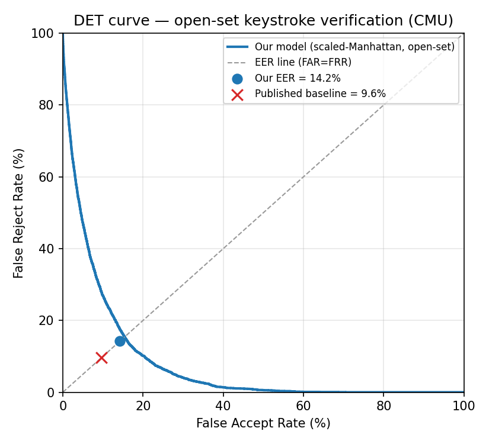
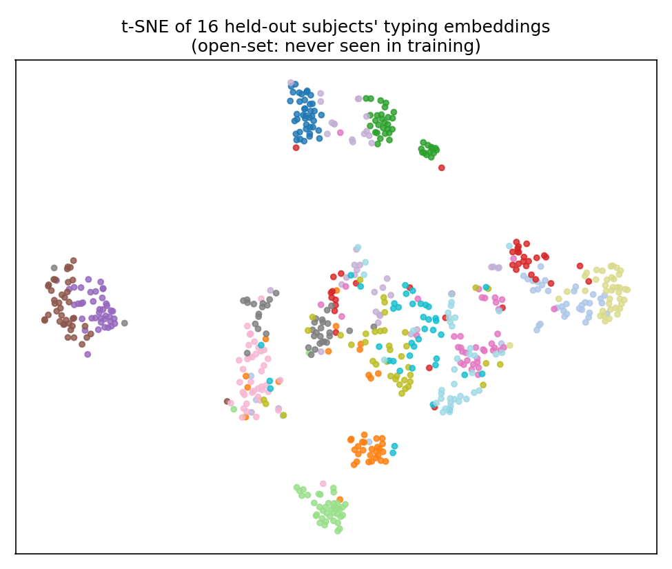

# Can You Be Recognised by the Way You Type?

### Verifying who someone is from their typing rhythm alone

|  |  |
|----|----|
| Author | Devadit Jain |
| Field | Machine learning · behavioural biometrics · online security |
| Type | Research and build |
| Dates | 25 November 2025 – 10 June 2026 |

## In brief

Someone broke into an account I cared about using a stolen password, and the system raised no alarm — the password was correct, so as far as the system knew, the attacker was me. This project asks whether the *way* a person types — their rhythm — could serve as a quiet second check that a stolen password cannot fake. I built a system that turns a burst of typing into a form of numerical fingerprint and decides whether a new burst matches. Tested on 51 people typing the same password, and judged only on people it had never seen, it was wrong about one decision in ten — good, but not quite good enough to beat the best method from a well-known 2009 study. This is an account of building it, of the mistake that nearly produced a far more impressive but entirely false result, and of what an honest near-miss is actually worth.

*(This can be followed without any background in code or AI. Where an idea becomes technical, I explain it first with an everyday comparison; the exact designs and figures are in Appendix C, and omitting it costs none of the argument.)*

## Contents

1. A password that defended nothing
2. You type like nobody else
3. Building a typing fingerprint
4. The number that was too good to be true
5. What I actually found
6. What it means, and what it does not
7. The ethics of a system that recognises you
8. What I got wrong, and what I would change
9. Acknowledgements · AI use · References · Appendices

------------------------------------------------------------------------

## 1. A password that defended nothing

Someone broke into an account I cared about using a stolen password, and the system raised no alarm — why would it? The password was correct, so as far as the system was concerned, the person typing it *was* me. This is the quiet flaw beneath every password ever made: it checks what you *know*, not who you *are*. Steal the secret, and you inherit the identity.

This is not a rare problem. Verizon's 2024 security report attributed about 88% of attacks on web applications to stolen passwords, most of them automated: attackers take millions of leaked passwords from one site and try them against the login pages of every other, on the assumption that people reuse them. Usually they do. Two-factor codes help, but they interrupt the user at every login, and anything that interrupts is eventually switched off.

So I asked a different question. What if the second check asked nothing of the user at all, and simply observed *how* they already type? Typing has a rhythm. The small pauses, the keys held a fraction longer than others, the slight hesitation before a capital — it is as personal as an accent, and it arises from motor habits that are hard to fake deliberately. The idea is old: a century ago, telegraph operators could recognise one another by the rhythm of their tapping. What is new is that computers have only recently become capable of doing this from *anything* a person types, rather than one memorised phrase.

That's the whole project in a sentence:

> **Can a computer tell it's really you from your typing rhythm alone — and how close can it get to the best published result?**

To keep myself honest later, I set out five specific objectives, each with a test that would show plainly whether it had been met, rather than a vague sense that the work was "going well":

1. **A working fingerprint.** Build a network that turns a burst of typing into a fixed-size list of numbers, on an ordinary laptop. *Done when* it fingerprints one sample in under a millisecond on a CPU and trains with no GPU.
2. **Fingerprints that cluster by person.** Train it so the same person's samples land close together and different people land far apart. *Done when* two samples from the same held-out person are reliably closer than two from different people.
3. **An honest score.** Test it only on people it has never seen, with the code refusing to grade itself on anyone it studied. *Done when* a runtime check makes a training/test overlap impossible, and I have an equal-error rate measured on at least 16 unseen people.
4. **A fair comparison built in.** Add a classical statistical decision-maker on top, so I can weigh a simple method against an elaborate one from the same run. *Done when* both scorers run on identical splits and I can report both error rates side by side.
5. **Reproducible and safe.** Make the whole thing rerun from one command, and show it running live and failing safely. *Done when* a pinned dataset (fixed fingerprint hash) and fixed random seeds reproduce the numbers, and the live service answers "ask for another factor" — never "let them in" — on any breakage.

(I return to these five objectives at the end and assess each one honestly — §5 and §8.)

**How the project ran.** The work ran in four stages across seven months, about 84 hours in total. The dates come from the project's commit history, not from memory.

| Stage | Planned | Actual |
|----|----|----|
| Typing app and keystroke capture | Nov–Dec 2025 | Nov–Dec 2025 |
| Accounts and the first recognisers | Jan–Feb 2026 | Feb–Mar 2026 |
| Deep-learning rebuild and open-set test | Mar–Apr 2026 | Jun 2026 |
| Analysis and write-up | May 2026 | Jun–Jul 2026 |

Two things slipped, both worth stating plainly. An eight-week exam pause over April and May stopped all work, so I settled every research decision on paper beforehand and ran the rebuild as one concentrated sprint in June. Then, midway through that sprint, I found the evaluation was flawed and had to rebuild it (§4), which meant re-running every figure that followed.

## 2. You type like nobody else

Recognising someone by their typing is a *behavioural* biometric — it concerns how a person acts, like a signature or a gait, rather than what their body is, like a fingerprint or an iris. The raw signal is only timing: how long each key is held, and the gaps between one key and the next. Unremarkable in isolation. Surprisingly personal in aggregate.

There is an easier version of the problem and a harder one. In the easy case, everyone types the *same* phrase, so matching keystrokes can be lined up and compared directly. In the hard case, the person types *anything*, so the rhythm must be read without relying on the words. Genuine, always-on security needs the hard version — and this is not a fantasy: in 2013, Frank and colleagues showed with a system called Touchalytics that even the way a person *swipes a touchscreen* carries enough identity to verify them continuously. Typing rhythm is the keyboard's equivalent of that same promise. I worked on the easier version — the one with a clean, public benchmark to measure against — while building the machinery the harder version would later require.

How, then, should such a system be scored? Any such system makes two opposite errors: it can admit an impostor, or reject the genuine user. The two trade off — tighten the system to catch more impostors and it begins to reject genuine users; loosen it and impostors slip through. Because the threshold can be set anywhere along that range, a single "accuracy" figure would be meaningless. The fair summary is the **equal error rate**: the setting at which both errors are equally likely. Lower is better. A 10% equal error rate means that, at the balanced setting, roughly one impostor in ten is admitted, while roughly one genuine user in ten is wrongly turned away. That single figure is the standard by which biometrics are compared, and it is the figure I set out to match.

Two studies mark the boundaries, and the notable point is that they never actually meet. In 2009, Killourhy and Maxion built the exact dataset I use — 51 people each typing the password `.tie5Roanl` 400 times — and tested 14 hand-built methods; their best scored 9.6%. That is the benchmark, and it belongs to one world: small, fixed-text data scored by features a human designed by hand. At the other extreme, a 2021 system called TypeNet learned from 136 million keystrokes across roughly 168,000 people and reached 2.2% — but that belongs to the opposite world, web-scale free typing read by a fully learned model. A recent review in *ACM Computing Surveys* traces the field making precisely that journey, from hand-built statistical detectors in the 2000s to deep learned representations in the 2020s. What no one had examined is the crossing point between the two: take a *learned* fingerprint and bring it *down* to the small, fixed-text benchmark — does it beat the older hand-built method on its own ground, tested fairly on strangers? That un-examined question, in the gap between the two worlds, is where a student with a laptop can contribute.

## 3. Building a typing fingerprint

There were three genuinely different ways to build this, and I weighed them before choosing:

- **Pure statistics** — compare each new sample against a hand-built statistical profile of the user. Simple, well understood, and the basis of the 2009 benchmark — but tied to one fixed phrase, and dependent on a human to decide which features matter.
- **A standard classifier** — train a network to sort typing into "user 1, user 2, …". Accurate, but it would have to be retrained from scratch every time a new user registers — unworkable for a real product.
- **A learned fingerprint** *(what I chose)* — train the network to *place* each sample in a space, so that a new user simply adds a few of their own points. No retraining, and not tied to one phrase.

Judged on the factors that actually decide whether a design survives contact with a real product:

| Approach | Cost of a new user signing up | Tied to one fixed phrase? | Feasible on a laptop? | Main risk |
|----|----|----|----|----|
| Pure statistics *(the 2009 benchmark)* | Cheap — build one statistical profile | **Yes** — phrase-locked | Yes | A human must hand-pick the features; can't extend to free typing |
| Standard classifier | **Ruinous** — retrain the whole network every signup | No | Trains on a laptop, but retraining kills it in production | Unusable as a live service; retraining latency grows with every user |
| Learned fingerprint *(chosen)* | Cheap — record ~12 of their samples, no retraining | No | Yes (~23 min to train once, <1 ms per check) | Needs enough people up front to learn a good space |

The classifier fails the one test that matters for a real login system — a network cannot be retrained every time someone registers — which ruled it out despite being the most accurate on paper. Of the other two, the learned fingerprint wins on phrase-independence and on adapting to future needs, so I chose it and placed the first approach on top: the old, trusted statistics run *inside* the learned space. That hybrid — classical statistics on a learned fingerprint — is the central idea of the project.

The fingerprint idea, in plain terms, is this. Picture a large space in which every burst of typing becomes a single point. Train the network well, and the same person's points fall into a tight cluster, while different people's clusters sit far apart. Recognising someone then becomes a question of distance: is this new point inside your cluster, or closer to someone else's? My network reduces each burst of typing to a list of 128 numbers — the point's position. The training uses the same method as face recognition: I present two samples from the same person and one from another, repeatedly, and adjust the network to draw the matching pair together and push the third away. Repeated hundreds of thousands of times, the clustering emerges on its own. (The exact network and settings are in Appendix C. It is small — it trains on a laptop in about 23 minutes and fingerprints a sample in under a thousandth of a second.)

Deciding whether a new sample is genuinely you then comes down to measuring how far its point sits from your enrolled cluster. I use three distance measures and combine them: a plain distance to the centre of the cluster, a distance to your nearest few enrolled samples, and a more sophisticated one that accounts for how much a person's own typing naturally varies. To *enrol* a new person, I record about a dozen of their points — no retraining — and set a personal threshold according to how consistent they are.

Finally, I integrated it into a working application: the user consents, types a few times to enrol, and is verified on a new sample. If anything fails — the service is down, or the model is the wrong version — it responds "cannot tell; request another factor", and never "let them in". As a brief live check, I enrolled one held-out person and passed genuine and impostor samples through the system: genuine samples scored 3.10 on average, impostors 6.73 (a lower score means more genuine). The deployed system therefore does rank impostors below the real user. It also failed on its first run, in a revealing way — which I return to below.

## 4. The number that was too good to be true

My first result looked excellent, and I was genuinely pleased with it. Then I re-read my own code and realised what had happened: the network had trained on *all* 51 people — including the very ones I was then testing it on. I had been grading it on people it had already studied.

It is one of the oldest mistakes in machine learning, and the analogy is exact: giving a student the exam questions the night before, then being impressed when they pass. The number was not a deliberate deception; the code had quietly produced a flattering result, and I had been willing to accept it. That was the point at which the project became science — the point at which I began treating a good result as something to *attack* rather than to celebrate.

The fix set the rule for everything that followed. I split the 51 people into 35 for training and 16 held back. The network sees only the 35, and is judged only on the 16 strangers, with a runtime check that makes it *impossible* for a test subject to leak into training. This is the honest test for authentication, because the only thing that matters is whether the system recognises people it has never met. It also cost me that flattering number: the honest error rate proved far higher than the leaked one. It was worth every point.

Most of the real work was debugging of this kind — and the useful bugs were never the ones a test caught, but the ones I found by asking whether a *passing* test actually proved what it claimed. Three more stand out. The live service crashed for one unusually consistent typist: typing the same password almost identically each time drove their personal threshold close to zero and caused a later calculation to overflow — something none of my test data, which was artificially varied, could have triggered. Only a real person did. On the first day, the real data file trained on all-zero timings, because its columns were named differently from my test fixture and my code read straight past them, reporting a plausible number throughout. And for a time, the blended decision-maker I was most pleased with was being measured *nowhere*: the evaluation scored only the simple distance, so the ensemble ran in the live product while earning no result at all. I noticed only when I asked why my supposedly better method had no figure to its name — and correctly wiring it into the evaluation is the source of the 10.2% figure. A method you have not measured is not a method; it is a hope. (The full log of thirteen fixes is in the project repository.)

## 5. What I actually found

The headline result, measured on the 16 strangers and averaged over three runs, is below. Lower is better.

| Decision method | Error rate | Compared with |
|----|----|----|
| Simple distance (the fair comparison) | **14.2%** | the 2009 benchmark's 9.6% |
| Full blended method | **10.2%** | — |

In plain terms: it works — it recognises strangers far better than chance, live and end to end. But on this small, fixed-password test it does *not* beat the 2009 hand-built method: 14.2% against 9.6%. An honest near-miss, not a success. (That single figure is the balanced point on a whole range of trade-offs; the full curve, from the strictest setting to the most lenient, is Figure B.1.)

Two things make the near-miss interesting. First, the blended method (10.2%) is not merely more accurate than the simple one (14.2%) — it is far *steadier*, barely moving between runs. I re-ran the whole test over 14 different random splits, and the blended method won on every one, which is very unlikely to be chance. On investigation, that steadiness comes almost entirely from one of the three distance measures (the more sophisticated one) — a specific finding, not a vague impression, and one that points to a straightforward future improvement. Second, I will be direct about the uncertainty: those headline runs fall on the favourable side. Across all 14 splits the averages are higher (about 18.7% and 13.3%), so the true gap to 9.6% is somewhat wider than the headline suggests.

The most striking result is not the average at all — it is how greatly individuals differ. The easiest person to recognise had an error rate under 1%; the hardest, over 33%. Same model, same password, and one person is *thirty-seven times* harder to identify than another. This is not random: the people the system struggles with are those whose own typing is so inconsistent that it overlaps with everyone else's. The real ceiling here, then, is not the model — it is how little identifying information an 11-key password contains.

This can even be seen directly. I reduced the 128-number fingerprints to a two-dimensional picture (Figure B.2): several people form tight, clearly separated clusters even though the model never trained on them, while a blurred region in the centre corresponds to the hard-to-recognise group. The picture and the numbers agree. And when I tried to improve matters — more training, more samples per person — nothing helped, and the model's internal measure showed that it had already learned everything the short password *can* teach. More effort cannot extract information that is not there. (The experiments behind all of this are in Appendix C.)

Did the five objectives I set myself (§1) hold up? For the most part, and I can point to where. The fingerprint works and runs in milliseconds on an ordinary laptop (O1); it clusters strangers it never trained on, as Figure B.2 shows (O2); the score is honest — measured open-set on 16 unseen people, behind a guard that makes a leak impossible (O3); the simple and blended scorers both come from a single run, so the comparison is fair rather than selective (O4); and the whole system re-runs from one command on a pinned dataset, failing safe when it breaks (O5). The one objective I set out to meet and did *not* is the headline aim itself — to beat the best published result. I came close, honestly, and fell short. That shortfall is the finding, not a footnote to it.

## 6. What it means, and what it does not

So, does typing rhythm prove who you are? In part, and honestly so. It works well enough to serve as a useful *second* check behind a password — an attacker holding your stolen password must still type as you do, at no extra effort to you; run continuously, it could even detect that the person mid-session had changed. It does not beat a good hand-built method on small, fixed-text data. And the genuinely useful finding is narrower, and more interesting, than "my model is good": placing classical statistics on top of a learned fingerprint makes the decision *more stable*, and I can identify exactly which component is responsible. The contribution here is not a new accuracy record — it is an honest, reproducible measurement that a classical verifier run *inside* a learned fingerprint is steadier than either half alone, with the single component responsible identified and every failure mode recorded rather than set aside. On a small public benchmark, tested only on strangers, that measurement did not exist before; now it does.

For context: my 14.2% sits above the 2009 method's 9.6% on its own ground, and far short of TypeNet's 2.2% — but that 2.2% is bought with internet-scale data I simply do not have. I also tested my design against a Transformer, the architecture behind most of today's best-known AI models, under identical conditions; it performed clearly worse, and less reliably (19.8%). On data this small, the built-in assumptions of my simpler design about timing and sequence outperform the more elaborate model's flexibility. That is a concrete reason to have chosen it, rather than a guess.

The limitations are real, and I would rather state them than have an assessor find them. A single small dataset. One 11-key password. A small model on a laptop. Fixed text only — the free-typing version is built, but not yet measured on a large corpus. And the confidence *percentage* the product displays is not yet calibrated, although the accept-or-reject ordering is sound. None of this makes the result wrong; all of it is a reason not to overstate it.

## 7. The ethics of a system that recognises you

Anything that can recognise people by their behaviour can also *monitor* them, so I treated the ethics as part of the design, not an afterthought.

- **Typing data is, legally, among the most protected kinds.** Under GDPR, biometric data used to identify someone is "special category" data, and the law explicitly includes behavioural traits. The moment this system identifies you, it is handling your most sensitive data — which shaped every decision below.
- **I used public, anonymous data — not new identifiable data.** The headline result is measured entirely on the 2009 benchmark, whose subjects are anonymised (s002, s005, …), consented to research use, and whose data its authors publish for exactly this purpose (reference 1). I deliberately did *not* train the reported model on real users of my product — that would have created fresh identifiable behavioural data, with all its consent and storage duties, for no scientific gain.
- **Consent is opt-in and revocable, and I store the fingerprint, not the typing.** Opting out deletes your profile. The service keeps no record of what you actually typed — only the derived fingerprint and a log of decisions. A stolen fingerprint is far less damaging than a recording of everything you wrote.
- **It fails safe, never open.** Any failure forces another factor; it never defaults to "let them in".
- **It fails some people more than others, and this is a fairness problem.** My own 37-fold spread in error rate (§5) is a textbook disparate-impact risk: the people it serves worst would be wrongly rejected far more often than the 14.2% average admits, and the average hides it completely. That is the concrete reason this must never be the *only* check, and why a real deployment needs a per-person error audit, not just an average. Those people are identifiable in advance (they are the least consistent typists), so a fair system can flag them and rely on a fallback rather than quietly failing them.
- **The same technology, in the wrong hands.** What protects an account could equally track or de-anonymise people by their typing. I present it as opt-in protection the user controls, report the error rates rather than conceal them, and would never present a 10%-error system as infallible.

## 8. What I got wrong, and what I would change

The single most important thing I learned was not a technique — it was to distrust my own results. My first evaluation produced a number I was delighted with, and it was worthless (§4). Recognising that meant training myself to ask "what would make this *wrong*?" before celebrating, and it is the habit I will keep long after I have forgotten the mathematics. It also taught me why biometrics depend on error-rate curves rather than plain accuracy: when a system can fail in two opposite ways, a single reassuring number conceals the trade-off that actually matters.

Working without a mentor had both costs and benefits. Every check on my work was one I carried out myself, which is probably why I eventually caught the flaw — I had learned to doubt my own code. But it is also precisely where working alone was a disadvantage: there was no one to look over my shoulder and ask whether those were my own training subjects. I made the mistake, and for a time I was the only person who could have caught it — and I did not. So if I were to do it again, I would write the entire evaluation procedure down *before* writing any of the code for it — on paper, the leak would have been obvious — and I would find one person permitted to doubt me, early on. Explaining a result aloud to someone catches what re-reading your own code never will.

Where I would take it next follows straight from the ceiling being the *data*, not the model:

- **Free typing on a large real dataset** (the 136-million-keystroke Aalto corpus). The pipeline is built; it needs only the data. This is the obvious next experiment.
- **Calibrate the confidence scale** so that the percentage the product displays is meaningful.
- **Train at scale** on appropriate hardware, in the manner of TypeNet, to test whether the hybrid's advantage holds as accuracy improves.
- **Collect a small, consented set of real users** to test whether it generalises across datasets — with the §7 safeguards built in from the outset.

I set out to determine, honestly, whether the way a person types could serve as a quiet second lock on their identity. It can — not a perfect one, and not yet better than a fifteen-year-old benchmark on a test this small, but a real one, measured and reproducible, built by someone who learned, the hard way, to stop trusting his own good news.

------------------------------------------------------------------------

## Acknowledgements

This was an independent project with no mentor, so the "people" who helped were the research community: Killourhy and Maxion for the dataset and the benchmark to beat; the teams behind FaceNet and TypeNet, whose methods I built on; Ledoit and Wolf for the statistical method at the heart of the result; and the maintainers of the open-source tools I used (PyTorch, NumPy, scikit-learn, FastAPI). I leaned on the international biometric-testing standard and the UK regulator's data-protection guidance to get the testing and the ethics right. AI assistance is disclosed just below.

## A note on AI use

I used Anthropic's Claude (via the Claude Code assistant), across the project's whole span (November 2025 – July 2026; the dated trail is in the commit history), for: first drafts of some functions, which I reviewed, ran and tested; help hunting bugs; surfacing papers, each of which I checked against the original before citing; and drafting and tightening this report, which I edited into my own voice. It produced no number in this report — every figure comes from code I ran and verified myself. I set the direction, made every scientific decision, and the mistakes in §4 are entirely my own.

## References

1. Killourhy, K. S. & Maxion, R. A. (2009). *Comparing Anomaly-Detection Algorithms for Keystroke Dynamics.* DSN-2009, pp. 125–134. Dataset: <https://www.cs.cmu.edu/~keystroke/>
2. Acien, A., Morales, A., Monaco, J. V., Vera-Rodriguez, R. & Fierrez, J. (2021). *TypeNet: Deep Learning Keystroke Biometrics.* IEEE T-BIOM. arXiv:2101.05570.
3. Schroff, F., Kalenichenko, D. & Philbin, J. (2015). *FaceNet: A Unified Embedding for Face Recognition and Clustering.* CVPR 2015. arXiv:1503.03832.
4. Hermans, A., Beyer, L. & Leibe, B. (2017). *In Defense of the Triplet Loss for Person Re-Identification.* arXiv:1703.07737.
5. Wen, Y., Zhang, K., Li, Z. & Qiao, Y. (2016). *A Discriminative Feature Learning Approach for Deep Face Recognition (center loss).* ECCV 2016.
6. Ledoit, O. & Wolf, M. (2004). *A Well-Conditioned Estimator for Large-Dimensional Covariance Matrices.* J. Multivariate Analysis 88(2), 365–411.
7. Dhakal, V., Feit, A. M., Kristensson, P. O. & Oulasvirta, A. (2018). *Observations on Typing from 136 Million Keystrokes (Aalto dataset).* CHI 2018. Data: <https://userinterfaces.aalto.fi/136Mkeystrokes/>
8. ISO/IEC 19795-1. *Biometric performance testing and reporting — Part 1.* <https://www.iso.org/standard/73515.html>
9. *Keystroke Dynamics: Concepts, Techniques, and Applications.* ACM Computing Surveys (2024/25). DOI 10.1145/3733103.
10. Frank, M. et al. (2013). *Touchalytics: Touchscreen Input as a Behavioral Biometric for Continuous Authentication.* IEEE TIFS 8(1). arXiv:1207.6231.
11. UK GDPR, Article 9 (special-category data) and Article 4(14) (biometric data). <https://gdpr-info.eu/art-9-gdpr/>
12. Verizon (2024). *2024 Data Breach Investigations Report.* <https://www.verizon.com/business/resources/reports/dbir/>
13. Cho, K. et al. (2014). *Learning Phrase Representations using RNN Encoder–Decoder (GRU).* EMNLP 2014. arXiv:1406.1078.
14. Bahdanau, D., Cho, K. & Bengio, Y. (2015). *Neural Machine Translation by Jointly Learning to Align and Translate (attention).* ICLR 2015. arXiv:1409.0473.
15. van der Maaten, L. & Hinton, G. (2008). *Visualizing Data using t-SNE.* JMLR 9, 2579–2605.
16. Kingma, D. P. & Ba, J. (2015). *Adam: A Method for Stochastic Optimization.* ICLR 2015. arXiv:1412.6980.

## Appendices

### Appendix A — Glossary

- **Biometric** — recognising a person from a trait; typing rhythm is a *behavioural* one.
- **Fingerprint / embedding** — the 128 numbers the model produces for one typing sample; same-person fingerprints land close together.
- **Equal error rate (EER)** — the balanced setting where "impostor gets in" and "real user locked out" are equally likely; 10% ≈ wrong one time in ten.
- **Open-set test** — judged only on people not seen in training; the honest test for authentication.
- **Mahalanobis / Ledoit–Wolf** — a distance measure that accounts for how much a person's own typing naturally varies, kept stable when enrolment samples are few.

### Appendix B — Full results, figures and provenance

Per-subject error rate (simple distance, seed 42), 16 held-out people, most to least distinctive:

| Rank | Subject | EER   |     | Rank | Subject | EER   |
|------|---------|-------|-----|------|---------|-------|
| 1    | s036    | 0.009 |     | 9    | s050    | 0.179 |
| 2    | s017    | 0.020 |     | 10   | s056    | 0.190 |
| 3    | s022    | 0.035 |     | 11   | s030    | 0.190 |
| 4    | s005    | 0.045 |     | 12   | s018    | 0.205 |
| 5    | s012    | 0.051 |     | 13   | s054    | 0.215 |
| 6    | s010    | 0.090 |     | 14   | s037    | 0.234 |
| 7    | s038    | 0.090 |     | 15   | s007    | 0.295 |
| 8    | s053    | 0.090 |     | 16   | s047    | 0.335 |

Average of these is 0.1421, matching the headline seed-42 figure. Aggregate over the three runs (seeds 42/43/44): simple distance 0.1422 ± 0.0279; full blend 0.1016 ± 0.0097; benchmark 0.0962. The 0.9%–33.5% spread is the §5 fairness finding.

**Provenance (for independent verification).**

- Dataset (`DSL-StrongPasswordData.csv`) SHA-256: `b11d23538b1865fa6ecf4e8b78567caa312e9c1027604bb022fcc6ad7eaa7a33`
- Git commit of the recorded run: `13fafe8f039d969fd77734b67d2457d37c59f918`
- Seeds 42 / 43 / 44 · 128-number fingerprint · 60 training passes · laptop CPU · ~23 min · Python 3.12, PyTorch 2.5.1 (CPU) — all versions pinned in `research/requirements.txt` (NumPy 2.1.3), so "the same environment" is a checkable claim, not a promise

**Figure B.1 — the error trade-off (DET curve).**

{width=3.4in}

*The trade-off between locking out genuine users and letting impostors in, across every dial setting, for the simple-distance method on the 16 strangers. The balanced (equal-error) point is at 14.2%; the 9.6% benchmark is marked.*

**Figure B.2 — the fingerprints, as a picture (t-SNE).**

{width=3.7in}

*Each person's 128-number fingerprints, squashed to a 2-D picture and coloured by person. Several people form tight, well-separated clusters though the model never trained on them; the muddy middle matches the hard-to-recognise people of §5.*

### Appendix C — Technical specification

*The exact designs and numbers, for readers who want them. None of it is needed to follow the report.*

**Features.** One window = one complete password entry (11 keystrokes; 51 subjects × 400 repetitions = 20,400 windows). Each keystroke = four timing features (hold, down–down, flight, up–up) plus a 16-dimensional learned character embedding (a 20-D per-keystroke vector). Timings are the dataset's raw values in seconds — differences only, shifted to a per-window origin (the first keystroke's down-time) purely to avoid float32 cancellation at large timestamp magnitudes; there is **no** per-feature normalisation or z-scoring, and negative flight times from overlapping keys pass through unclamped. The identical featurisation code runs in training and serving, so the deployed model cannot see different features from the trained one.

**Encoder (`KeystrokeEncoder`, 83,505 parameters, 0.32 MB float32).** Input fusion (20-D) → two `Conv1d` layers (20→64→64, kernel 3) → bidirectional GRU (64 each way → 128; Cho et al., 2014) → single-head additive attention with a length mask (Bahdanau et al., 2015) → linear projection to 128-D → L2-normalisation. Embeds one window in ≈ 0.8 ms (mean of 200 runs, batch of one).

**Training.** Batch-hard triplet loss (margin 0.2; Hermans et al., 2017) + center loss (weight 0.01; Wen et al., 2016), Adam (lr 1e-3; Kingma & Ba, 2015), 60 epochs, batches of 16 subjects × 2 windows = 32, squared-Euclidean distance on L2-normalised embeddings. Deterministic: same seed → same weights bit-for-bit on CPU.

**Verification ensemble.** Enrolment stores the centroid, the enrolment embeddings (k-NN, k = 3), and the Ledoit–Wolf inverse-covariance matrix. Score = unweighted mean of (i) L1 distance to the centroid, (ii) mean L1 distance to the 3 nearest enrolment embeddings, (iii) Ledoit–Wolf Mahalanobis distance; singular covariance falls back to the centroid distance. Per-user threshold = 90th percentile of leave-one-out genuine distances × 1.15, floored at 10⁻³ — the exact floor whose absence caused the live crash of §4. Note the two enrolment regimes: the *benchmark* enrols with 200 windows (half a subject's data) to measure what the representation can do; the *product* enrols with about a dozen, which is workable only because the leave-one-out threshold adapts to however consistent that user's dozen turns out to be.

**Why these pieces work — the mechanism, not just the name.** *L2-normalisation* divides each fingerprint by its own length so every one lands on the surface of a unit sphere; that makes "how far apart" depend on the *direction* of the rhythm pattern rather than its *magnitude* (roughly, its shape rather than how fast someone types overall) — the right thing when you're comparing patterns. *Batch-hard triplet loss* trains on triples of (same, same, different): for each anchor it seeks out the *hardest* pair actually present in the mini-batch — the same-person sample that landed farthest away and the different-person sample that landed closest — and pushes them apart by a fixed margin, so the training spends its effort on the genuinely confusable cases instead of the easy ones. *Ledoit–Wolf shrinkage* solves a concrete small-sample problem: with only ~12 enrolment samples living in 128 dimensions, the ordinary covariance matrix that a Mahalanobis distance needs is wildly unstable and often not even invertible, so I blend it toward a well-behaved target — just enough to guarantee a stable, invertible matrix, which is exactly the few-samples-in-many-dimensions situation every new user's enrolment sits in. That third point is *why* the Mahalanobis term ends up carrying the ensemble (see below): it is the only one of the three distances that models how a person's typing dimensions **co-vary**, not merely how far each one sits from their average.

**Evaluation.** Open-set 35/16 subject split (seeded). Per test subject, the *earlier* 200 of their 400 windows enrol and the *later* 200 are tested — a positional split, chosen deliberately so enrolment never sees the future (mildly pessimistic under session drift, never flattering). Impostors = all 400 windows of each of the other 15 test subjects (6,000 impostor scores per subject). The evaluator raises an error rather than invent a number if a test set would be empty. The headline is the *mean of per-subject EERs*, matching the 2009 baseline's methodology — not the pooled-score EER, which mixes subjects with different score scales (pooled, seed 42: 16.1%). Two scorers (scaled-Manhattan headline; full ensemble secondary), never cross-compared. Seeds 42/43/44 for the headline; 14 seeds for the ensemble-vs-primary comparison — the ensemble wins 14/14 (Wilcoxon signed-rank *p* ≈ 0.0001). Subject-level bootstrap (20,000 draws) gives a 95% CI of [9.5%, 19.2%] on the seed-42 14.2%. Separability (nearest-impostor distance ÷ within-subject scatter) vs. per-subject EER: Spearman ρ = −0.84, *p* = 0.0001. 14-seed means: primary ≈ 18.7%, ensemble ≈ 13.3%.

**Operating points (because a real deployment must pick a dial setting, not sit at the balanced point).** On the pooled seed-42 score distribution — one global threshold, so these are *more pessimistic* than the per-user thresholds actually deployed — tolerating a 5% lock-out rate for genuine users admits ≈18.5% of impostor attempts; tolerating 10% lock-out admits ≈12.4%. This is the security-vs-convenience dial of §2 in numbers, and it is why this system is a second factor, never the only lock.

**Hyperparameter search (nested validation).** Test 16 held out; inside the 35, a 24-inner-train / 11-validation split; one setting changed at a time, judged only on the 11:

| Change from original | Validation EER (primary / ensemble) |
|----|----|
| Original (60 epochs, margin 0.2, centre 0.01, 2 windows/subj) | 0.1933 / 0.1678 |
| more windows/subj (2→4) | 0.2572 / 0.1731 |
| more windows/subj (2→8) | 0.1975 / 0.2023 |
| longer training (60→120 epochs) | 0.1904 / 0.1684 |
| wider margin (0.2→0.3) | 0.1933 / 0.1678 |
| stronger centre-loss (0.01→0.05) | 0.2054 / 0.1725 |

The validation "winner" (120 epochs) scored 0.1610 ± 0.0866 / 0.1128 ± 0.0378 on the real test — worse and less stable than the original's 0.1422 ± 0.0279 / 0.1016 ± 0.0097, with one seed at 0.284. Training loss saturates at the margin in every row: the bottleneck is the 11-key password, not the optimisation.

**Which distance carries the ensemble.** Mean over 3 seeds: full 0.1016; drop centroid-L1 0.1016; drop k-NN 0.1016; drop Mahalanobis 0.1330. Over 14 seeds: full 0.1326; drop Mahalanobis 0.1783; drop either other term 0.1326. The Ledoit–Wolf Mahalanobis term carries essentially all of the advantage; the other two are numerically swamped by its larger scale. Rescaling the three before blending would let the other two contribute.

**Transformer comparison.** A comparable Transformer encoder (2 layers, 4 heads, 77,296 parameters — slightly *smaller* than the CNN+BiGRU), identical protocol, same 3 seeds: primary EER 19.8% ± 5.4%, ensemble 12.3% ± 4.9%, against this model's 14.2% ± 2.8% and 10.2% ± 1.0%. Both models' loss saturates at the margin, so both are data-limited; the convolution/recurrence priors extract a steadier signal from small data than self-attention.
